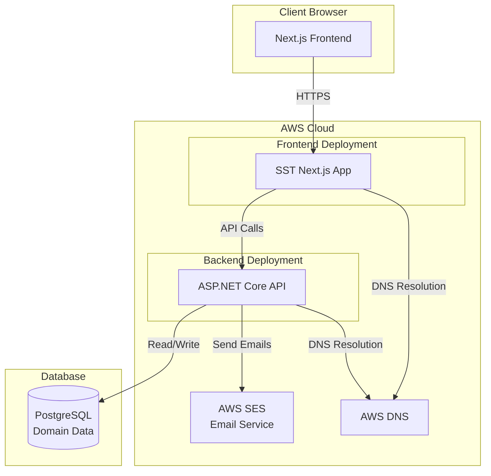
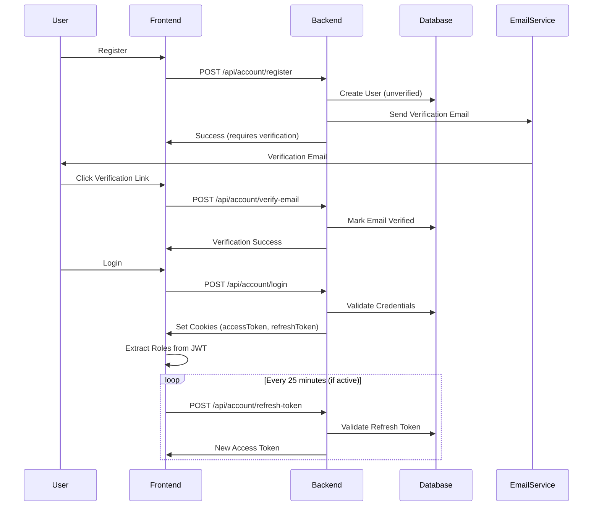
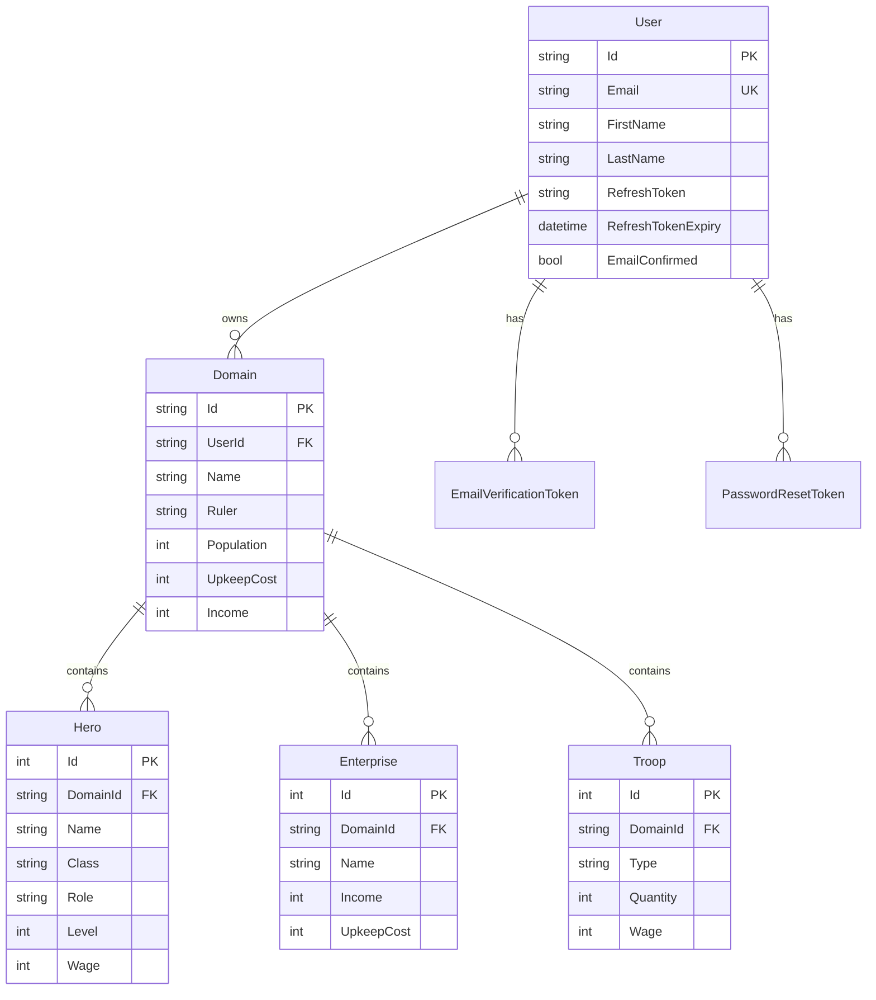

# Fantasy Domain Manager

A full-stack web application for managing fantasy domains, heroes, enterprises, and troops with financial calculations. Built with ASP.NET Core 8.0 backend and Next.js 16 frontend, deployed on AWS using SST (Serverless Stack).

## Table of Contents

- [Project Overview](#project-overview)
- [Architecture](#architecture)
- [Backend Documentation](#backend-documentation)
- [Frontend Documentation](#frontend-documentation)
- [Infrastructure](#infrastructure)
- [Development Setup](#development-setup)
- [API Documentation](#api-documentation)
- [Security Considerations](#security-considerations)
- [Deployment](#deployment)
- [Troubleshooting](#troubleshooting)

## Project Overview

Fantasy Domain Manager is a comprehensive domain management system designed for tabletop RPG players and game masters. The application allows users to:

- Create and manage fantasy domains with rulers, populations, and financial data
- Track heroes with levels, classes, roles, and wages
- Manage enterprises with income and upkeep costs
- Organize troops by type, quantity, and wages
- Calculate financial projections over multiple months with random variance
- Administer user accounts and roles

### Tech Stack Summary

**Backend:**
- ASP.NET Core 8.0 Web API
- PostgreSQL database with Entity Framework Core
- JWT authentication with cookie-based tokens
- AWS SES for email delivery
- FluentValidation for input validation
- HTML sanitization for XSS prevention

**Frontend:**
- Next.js 16 with App Router
- React 19
- TypeScript
- Tailwind CSS 4
- Cookie-based authentication

**Infrastructure:**
- SST (Serverless Stack) for deployment
- AWS (Next.js hosting, SES, DNS)
- PostgreSQL (RDS or self-hosted)

## Architecture

### System Architecture



### Authentication Flow



### Data Model Relationships



## Backend Documentation

### Technology Stack

The backend is built with ASP.NET Core 8.0 and uses the following key technologies:

- **ASP.NET Core 8.0**: Web API framework
- **Entity Framework Core 8.0**: ORM for database operations
- **Npgsql.EntityFrameworkCore.PostgreSQL**: PostgreSQL provider
- **Microsoft.AspNetCore.Identity.EntityFrameworkCore**: User management and authentication
- **System.IdentityModel.Tokens.Jwt**: JWT token generation and validation
- **FluentValidation**: Input validation
- **HtmlSanitizer**: XSS prevention through HTML sanitization
- **AWSSDK.SimpleEmail**: AWS SES integration for email delivery
- **Swashbuckle.AspNetCore**: Swagger/OpenAPI documentation

### Project Structure

```
backend/
├── Controllers/
│   ├── AccountController.cs      # Authentication endpoints
│   ├── ReadController.cs         # Read-only API endpoints
│   ├── WriteController.cs        # Write operations (CRUD)
│   ├── AdminController.cs        # Admin-only endpoints
│   └── BaseApiController.cs      # Base controller with common functionality
├── Models/
│   ├── User.cs                    # User entity (extends IdentityUser)
│   ├── Domain.cs                  # Domain entity
│   ├── Hero.cs                    # Hero entity
│   ├── Enterprise.cs              # Enterprise entity
│   ├── Troop.cs                   # Troop entity
│   ├── EmailVerificationToken.cs  # Email verification tokens
│   └── PasswordResetToken.cs      # Password reset tokens
├── Services/
│   ├── TokenService.cs            # JWT token generation
│   ├── AwsSesEmailService.cs      # Email delivery via AWS SES
│   ├── EmailVerificationService.cs # Email verification logic
│   ├── PasswordResetService.cs    # Password reset logic
│   ├── FinancialCalculationService.cs # Financial projections
│   └── InputSanitizationService.cs   # XSS prevention
├── DTOs/
│   ├── AuthDtos/                  # Authentication DTOs
│   ├── CreateDtos/                # Creation DTOs
│   └── UpdateDtos/                # Update DTOs
├── Validators/                     # FluentValidation validators
├── DbContexts/
│   └── DomainDb.cs                 # EF Core DbContext
├── Extensions/                     # Extension methods
├── Configuration/                  # Configuration classes
└── Migrations/                     # EF Core migrations
```

### Authentication & Authorization

#### JWT-Based Authentication

The application uses JWT tokens stored in HttpOnly cookies for security:

- **Access Token**: 30-minute expiration, stored in `accessToken` cookie
- **Refresh Token**: 7-day expiration, stored in `refreshToken` cookie
- **Token Storage**: HttpOnly cookies prevent XSS attacks
- **Secure Flag**: Enabled in production (HTTPS only)
- **SameSite Policy**: Lax mode for cross-site compatibility

#### Role-Based Access Control

Two roles are defined:
- **Member**: Default role for registered users
- **Admin**: Administrative access to user management

Roles are stored in the Identity system and included in JWT claims.

#### Email Verification Flow

1. User registers → account created with `EmailConfirmed = false`
2. Verification token generated and stored (24-hour expiration)
3. Verification email sent via AWS SES
4. User clicks link → token validated → email confirmed
5. User can now log in

#### Password Reset Flow

1. User requests password reset → token generated (1-hour expiration)
2. Reset email sent via AWS SES
3. User clicks link → token validated → password reset allowed
4. Password changed → notification email sent

### API Endpoints

#### Account Endpoints (`/api/account`)

| Method | Endpoint | Description | Rate Limit |
|--------|----------|-------------|------------|
| POST | `/register` | Register new user | 3/hour/IP |
| POST | `/login` | Authenticate user | 5/15min/IP |
| POST | `/logout` | Logout and invalidate tokens | - |
| POST | `/refresh-token` | Refresh access token | - |
| POST | `/verify-email` | Verify email address | - |
| POST | `/resend-verification` | Resend verification email | 3/hour/IP |
| POST | `/forgot-password` | Request password reset | 3/hour/IP |
| POST | `/reset-password` | Reset password with token | 5/hour/IP |
| GET | `/validate-reset-token` | Validate reset token | - |

#### Domain Endpoints

**Read Operations** (`/api/Read/domains`):
- `GET /domains` - Get all user's domains
- `GET /domains/{id}` - Get domain by ID with related entities
- `POST /domains/{id}/calculate-financials` - Calculate financial projections

**Write Operations** (`/api/Write/domains`):
- `POST /domains` - Create new domain
- `PUT /domains/{id}` - Update domain
- `DELETE /domains/{id}` - Delete domain (if no related entities)

#### Hero/Enterprise/Troop Endpoints

Similar structure for each entity type:
- `GET /{entity}` - Get all user's entities
- `GET /{entity}/{id}` - Get entity by ID
- `GET /domains/{domainId}/{entity}` - Get entities by domain
- `POST /{entity}` - Create entity
- `PUT /{entity}/{id}` - Update entity
- `DELETE /{entity}/{id}` - Delete entity

#### Admin Endpoints (`/api/admin`)

Requires Admin role:
- `GET /users-with-roles` - Get all users with roles
- `POST /edit-roles/{userId}` - Update user roles
- `DELETE /users/{userId}` - Delete user

### Security Features

#### Rate Limiting

Multiple rate limiting policies protect against abuse:

- **LoginPolicy**: 5 attempts per 15 minutes per IP (sliding window)
- **RegisterPolicy**: 3 attempts per hour per IP (fixed window)
- **ApiPolicy**: 100 requests per minute per user/IP (sliding window)
- **ForgotPasswordPolicy**: 3 attempts per hour per IP
- **ResetPasswordPolicy**: 5 attempts per hour per IP
- **ResendVerificationPolicy**: 3 attempts per hour per IP

#### Input Sanitization

All user inputs are sanitized using `InputSanitizationService`:

- **HTML Stripping**: Plain text fields (names, titles) have HTML stripped
- **HTML Sanitization**: Rich text fields (notes) are sanitized to allow safe HTML
- **XSS Prevention**: Prevents script injection attacks

#### CORS Configuration

CORS is configured to allow requests from specified origins:

- Configurable via `CORS:AllowedOrigins` environment variable or `AllowedOrigins` in appsettings
- Supports comma-separated origins
- Credentials allowed for cookie-based authentication
- Defaults to `http://localhost:3000` in development

#### Content Security Policy

Strict CSP headers are set:

```
default-src 'self';
script-src 'self';
style-src 'self' 'unsafe-inline';
img-src 'self' data:;
font-src 'self';
connect-src 'self';
frame-ancestors 'none';
base-uri 'self';
form-action 'self';
```

#### Account Lockout

- Maximum 5 failed login attempts
- 15-minute lockout period
- Automatic unlock after lockout expires

### Database Schema

#### Key Indexes

- `Users.Email`: Unique index
- `Domains.UserId`: Indexed for user queries
- `Heroes.DomainId`, `Enterprises.DomainId`, `Troops.DomainId`: Indexed for domain queries
- `EmailVerificationTokens.Token`: Unique index
- `PasswordResetTokens.Token`: Unique index
- Expiry indexes on token tables for cleanup

#### Entity Relationships

- **User → Domain**: One-to-many (user owns multiple domains)
- **Domain → Hero/Enterprise/Troop**: One-to-many (domain contains multiple entities)
- **User → EmailVerificationToken**: One-to-many (multiple tokens per user)
- **User → PasswordResetToken**: One-to-many (multiple tokens per user)

### Configuration

#### Required appsettings.json Values

```json
{
  "ConnectionStrings": {
    "Domains": "Host=...;Database=...;Username=...;Password=...;SSL Mode=Require"
  },
  "TokenKey": "YourSecretKeyAtLeast64CharactersLong",
  "AdminSeed": {
    "Email": "admin@example.com",
    "FirstName": "Admin",
    "LastName": "User",
    "Password": "SecurePassword123!"
  },
  "AWS": {
    "SES": {
      "Region": "us-east-1",
      "SenderEmail": "noreply@fantasydomainmanager.com",
      "SenderName": "Fantasy Domain Manager"
    }
  },
  "Email": {
    "BaseUrl": "https://fantasydomainmanager.com",
    "VerificationTokenExpiryMinutes": "1440",
    "ResetTokenExpiryMinutes": "60"
  },
  "AllowedOrigins": [
    "http://localhost:3000",
    "https://fantasydomainmanager.com"
  ]
}
```

#### Environment Variables

- `ConnectionStrings__Domains`: Database connection string
- `TokenKey`: JWT signing key (64+ characters)
- `CORS__AllowedOrigins`: Comma-separated allowed origins
- `AWS__SES__Region`: AWS SES region
- `AWS__SES__SenderEmail`: Verified SES sender email
- `Email__BaseUrl`: Base URL for email links

## Frontend Documentation

### Technology Stack

The frontend is built with modern web technologies:

- **Next.js 16**: React framework with App Router
- **React 19**: UI library
- **TypeScript**: Type-safe JavaScript
- **Tailwind CSS 4**: Utility-first CSS framework
- **Node.js 22+**: Runtime requirement

### Project Structure

```
client/
├── app/
│   ├── page.tsx                   # Home page
│   ├── layout.tsx                 # Root layout
│   ├── providers.tsx              # Context providers
│   ├── globals.css                # Global styles
│   ├── login/
│   │   └── page.tsx               # Login page
│   ├── register/
│   │   └── page.tsx               # Registration page
│   ├── domains/
│   │   ├── page.tsx               # Domain list
│   │   └── [id]/
│   │       └── page.tsx           # Domain detail
│   ├── profile/
│   │   └── page.tsx               # User profile
│   ├── admin/
│   │   └── users/
│   │       └── page.tsx           # Admin user management
│   ├── verify-email/
│   │   └── page.tsx               # Email verification
│   ├── forgot-password/
│   │   └── page.tsx               # Password reset request
│   └── reset-password/
│       └── page.tsx               # Password reset
├── components/
│   ├── Header.tsx                 # Navigation header
│   ├── Footer.tsx                 # Footer
│   ├── DomainCard.tsx             # Domain card component
│   ├── HeroCard.tsx               # Hero card component
│   ├── EnterpriseCard.tsx         # Enterprise card component
│   ├── TroopCard.tsx              # Troop card component
│   ├── HeroSection.tsx            # Hero section component
│   ├── EnterpriseSection.tsx      # Enterprise section component
│   ├── TroopSection.tsx           # Troop section component
│   ├── Modal.tsx                  # Modal dialog
│   ├── AdminGuard.tsx             # Admin route protection
│   └── Contact.tsx                # Contact form
├── contexts/
│   └── AuthContext.tsx            # Authentication state management
├── lib/
│   ├── api.ts                     # API client with auto-refresh
│   └── jwt.ts                     # JWT utilities
└── types/
    └── models.ts                  # TypeScript type definitions
```

### Authentication Flow

#### Cookie-Based Token Management

The frontend uses HttpOnly cookies for secure token storage:

1. **Login**: Backend sets `accessToken` and `refreshToken` cookies
2. **API Requests**: Cookies automatically sent with `credentials: 'include'`
3. **Token Refresh**: Automatic refresh on 401 responses
4. **Logout**: Cookies cleared on both frontend and backend

#### Automatic Token Refresh

The `AuthContext` implements intelligent token refresh:

- **Background Refresh**: Every 25 minutes if user is active
- **Activity Tracking**: Only refreshes if user activity in last 30 minutes
- **401 Interceptor**: Automatic refresh on API 401 responses
- **Queue System**: Prevents multiple simultaneous refresh requests

#### Silent Authentication

On page load, the app attempts silent authentication:

1. Check for `refreshToken` cookie
2. Call `/api/account/refresh-token`
3. If valid, extract user data and roles from JWT
4. Update AuthContext state

### State Management

#### AuthContext

Centralized authentication state:

```typescript
interface AuthContextType {
  user: User | null;
  loading: boolean;
  login: (user: User, tokenExpiry: string) => void;
  logout: () => void;
  isAuthenticated: boolean;
  isAdmin: boolean;
  updateTokenExpiry: (expiry: string) => void;
}
```

#### Role Extraction

Roles are extracted from JWT token claims:

- JWT contains role claims from Identity system
- `extractRolesFromToken()` parses JWT payload
- Roles stored in user state for authorization checks

### API Integration

#### Centralized API Client

The `lib/api.ts` file provides a centralized API client:

- **Automatic Cookie Handling**: All requests include credentials
- **Token Refresh Interceptor**: Handles 401 responses automatically
- **Error Handling**: Standardized error responses
- **Type Safety**: Full TypeScript support

#### API Methods

Organized by entity type:

- `domainApi`: Domain CRUD operations
- `heroApi`: Hero CRUD operations
- `enterpriseApi`: Enterprise CRUD operations
- `troopApi`: Troop CRUD operations
- `authApi`: Authentication operations
- `adminApi`: Admin operations

### UI Features

#### Domain Management

- **Domain List**: Grid view of all user domains
- **Domain Detail**: Full domain view with related entities
- **Create/Edit Modal**: Inline editing for domains
- **Financial Calculator**: Project income/expenses over months

#### Entity Sections

Each domain detail page includes:
- **Hero Section**: List of heroes with levels, classes, roles
- **Enterprise Section**: List of enterprises with income/upkeep
- **Troop Section**: List of troops with quantities and wages

#### Admin Interface

- **User List**: Table of all users with roles
- **Role Management**: Add/remove roles from users
- **User Deletion**: Remove users (admin only)

## Infrastructure

### Deployment Platform

The application uses **SST (Serverless Stack)** for infrastructure as code and deployment.

### AWS Services

#### Next.js Deployment

- **SST AWS Nextjs Component**: Deploys Next.js app to AWS
- **Runtime**: Node.js 22.x
- **Domain**: `fantasydomainmanager.com`
- **DNS**: Managed by `sst.aws.dns()`
- **SSL/TLS**: Automatically handled by SST

#### AWS SES

- **Email Delivery**: Transactional emails (verification, password reset)
- **Region**: us-east-1
- **Sender**: Verified email address required
- **Templates**: HTML and plain text email templates

### Configuration

#### sst.config.ts

```typescript
export default $config({
  app(input) {
    return {
      name: "fantasy-domain-frontend",
      removal: input?.stage === "production" ? "retain" : "remove",
      home: "aws",
      providers: {
        aws: {
          region: "us-east-1",
        },
      },
    };
  },
  async run() {
    new sst.aws.Nextjs("Site", {
      path: ".",
      server: {
        runtime: "nodejs22.x",
      },
      domain: {
        name: "fantasydomainmanager.com",
        dns: sst.aws.dns(),
      },
      environment: {
        NEXT_PUBLIC_API_URL: "https://api.fantasydomainmanager.com/",
        NEXT_PUBLIC_ENVIRONMENT: "Production",
      },
    });
  },
});
```

#### Environment Variables

- `NEXT_PUBLIC_API_URL`: Backend API URL
- `NEXT_PUBLIC_ENVIRONMENT`: Environment identifier

### Deployment Process

#### SST Deployment

1. **Install SST CLI**: `npm install -g sst`
2. **Configure AWS Credentials**: AWS CLI or environment variables
3. **Deploy**: `npm run sst:deploy` (runs `sst deploy --stage prod`)
4. **Monitor**: SST provides deployment URLs and logs

#### Environment-Specific Configuration

- **Production**: `removal: "retain"` (prevents accidental deletion)
- **Development**: `removal: "remove"` (cleanup on destroy)
- **Stage Parameter**: Allows multiple environments

## Development Setup

### Prerequisites

- **.NET 8.0 SDK**: [Download](https://dotnet.microsoft.com/download/dotnet/8.0)
- **Node.js 22+**: [Download](https://nodejs.org/)
- **PostgreSQL**: Database server (local or remote)
- **AWS Account**: For SES email delivery (development can use local email logs)

### Backend Setup

1. **Clone Repository**
   ```bash
   git clone <repository-url>
   cd FantasyDomainManager/backend
   ```

2. **Configure Connection String**
   
   Edit `appsettings.json` or `appsettings.Development.json`:
   ```json
   {
     "ConnectionStrings": {
       "Domains": "Host=localhost;Database=fantasy_domains;Username=postgres;Password=yourpassword;SSL Mode=Prefer"
     }
   }
   ```

3. **Configure JWT Token Key**
   
   Set a secure token key (64+ characters):
   ```json
   {
     "TokenKey": "YourSuperSecretDevelopmentTokenKeyThatMustBeAtLeast64CharactersLongForJWTTokenSigning1234567890"
   }
   ```

4. **Configure Admin Seed**
   
   Set admin user credentials:
   ```json
   {
     "AdminSeed": {
       "Email": "admin@example.com",
       "FirstName": "Admin",
       "LastName": "User",
       "Password": "SecurePassword123!"
     }
   }
   ```

5. **Configure AWS SES** (optional for development)
   
   For development, emails are logged to `email-logs/` directory:
   ```json
   {
     "AWS": {
       "SES": {
         "Region": "us-east-1",
         "SenderEmail": "noreply@fantasydomainmanager.com",
         "SenderName": "Fantasy Domain Manager"
       }
     }
   }
   ```

6. **Run Migrations**
   ```bash
   dotnet ef database update
   ```

7. **Run Development Server**
   ```bash
   dotnet run
   ```
   
   Backend runs on `https://localhost:5223` (or port specified in `launchSettings.json`)

8. **Access Swagger Documentation**
   
   Navigate to `https://localhost:5223/swagger` in development mode

### Frontend Setup

1. **Navigate to Client Directory**
   ```bash
   cd ../client
   ```

2. **Install Dependencies**
   ```bash
   npm install
   ```

3. **Configure API URL**
   
   Create `.env.local` or set environment variable:
   ```bash
   NEXT_PUBLIC_API_URL=http://localhost:5223/api
   ```

4. **Run Development Server**
   ```bash
   npm run dev
   ```
   
   Frontend runs on `http://localhost:3000`

### Database Setup

#### PostgreSQL Installation

**macOS (Homebrew):**
```bash
brew install postgresql@15
brew services start postgresql@15
```

**Linux (Ubuntu/Debian):**
```bash
sudo apt update
sudo apt install postgresql postgresql-contrib
sudo systemctl start postgresql
```

**Windows:**
Download from [PostgreSQL Downloads](https://www.postgresql.org/download/windows/)

#### Create Database

```sql
CREATE DATABASE fantasy_domains;
CREATE USER fdm_user WITH PASSWORD 'yourpassword';
GRANT ALL PRIVILEGES ON DATABASE fantasy_domains TO fdm_user;
```

#### Connection String Format

```
Host=localhost;Database=fantasy_domains;Username=fdm_user;Password=yourpassword;SSL Mode=Prefer
```

#### Run Migrations

```bash
cd backend
dotnet ef database update
```

### Environment Variables

#### Backend Required Variables

- `ConnectionStrings__Domains`: PostgreSQL connection string
- `TokenKey`: JWT signing key (64+ characters)
- `CORS__AllowedOrigins`: Comma-separated allowed origins (optional)
- `AWS__SES__Region`: AWS region for SES (optional for dev)
- `AWS__SES__SenderEmail`: Verified SES email (optional for dev)
- `Email__BaseUrl`: Base URL for email links

#### Frontend Required Variables

- `NEXT_PUBLIC_API_URL`: Backend API base URL
- `NEXT_PUBLIC_ENVIRONMENT`: Environment identifier (optional)

#### AWS Credentials

For production deployment and SES:

```bash
export AWS_ACCESS_KEY_ID=your_access_key
export AWS_SECRET_ACCESS_KEY=your_secret_key
export AWS_DEFAULT_REGION=us-east-1
```

Or use AWS CLI:
```bash
aws configure
```

## API Documentation

### Base URL

**Development:**
```
http://localhost:5223/api
```

**Production:**
```
https://api.fantasydomainmanager.com/api
```

### Authentication

All authenticated endpoints require valid JWT tokens stored in cookies:

- **accessToken**: HttpOnly cookie with 30-minute expiration
- **refreshToken**: HttpOnly cookie with 7-day expiration

Cookies are automatically sent with requests when `credentials: 'include'` is set.

### Endpoints

#### Account Endpoints

##### Register

```http
POST /api/account/register
Content-Type: application/json

{
  "email": "user@example.com",
  "password": "SecurePassword123!",
  "confirmPassword": "SecurePassword123!",
  "firstName": "John",
  "lastName": "Doe"
}
```

**Response:**
```json
{
  "message": "Registration successful. Please check your email to verify your account.",
  "email": "user@example.com"
}
```

**Rate Limit:** 3 requests per hour per IP

##### Login

```http
POST /api/account/login
Content-Type: application/json

{
  "email": "user@example.com",
  "password": "SecurePassword123!"
}
```

**Response:**
```json
{
  "id": "user-id",
  "email": "user@example.com",
  "name": "John Doe",
  "token": "jwt-token",
  "tokenExpiry": "2024-01-01T12:30:00Z"
}
```

**Rate Limit:** 5 requests per 15 minutes per IP

##### Refresh Token

```http
POST /api/account/refresh-token
```

Uses `refreshToken` cookie automatically.

**Response:** Same as login response

##### Logout

```http
POST /api/account/logout
```

Clears authentication cookies.

##### Verify Email

```http
POST /api/account/verify-email
Content-Type: application/json

{
  "token": "verification-token"
}
```

##### Forgot Password

```http
POST /api/account/forgot-password
Content-Type: application/json

{
  "email": "user@example.com"
}
```

**Rate Limit:** 3 requests per hour per IP

##### Reset Password

```http
POST /api/account/reset-password
Content-Type: application/json

{
  "token": "reset-token",
  "newPassword": "NewSecurePassword123!",
  "confirmPassword": "NewSecurePassword123!"
}
```

**Rate Limit:** 5 requests per hour per IP

#### Domain Endpoints

##### Get All Domains

```http
GET /api/Read/domains
```

**Response:**
```json
[
  {
    "id": "domain-id",
    "name": "Kingdom of Eldoria",
    "ruler": "King Arthur",
    "population": 50000,
    "income": 10000,
    "upkeepCost": 5000
  }
]
```

##### Get Domain by ID

```http
GET /api/Read/domains/{id}
```

**Response:** Domain with related heroes, enterprises, and troops

##### Create Domain

```http
POST /api/Write/domains
Content-Type: application/json

{
  "name": "Kingdom of Eldoria",
  "ruler": "King Arthur",
  "population": 50000,
  "income": 10000,
  "upkeepCost": 5000
}
```

##### Update Domain

```http
PUT /api/Write/domains/{id}
Content-Type: application/json

{
  "name": "Updated Name",
  "ruler": "Updated Ruler",
  "population": 60000
}
```

##### Delete Domain

```http
DELETE /api/Write/domains/{id}
```

**Note:** Domain must have no related heroes, enterprises, or troops.

##### Calculate Financials

```http
POST /api/Read/domains/{id}/calculate-financials
Content-Type: application/json

{
  "months": 12
}
```

**Response:**
```json
{
  "totalMonths": 12,
  "totalIncome": 120000,
  "totalExpenses": 60000,
  "netTotal": 60000,
  "monthlyBreakdowns": [
    {
      "month": 1,
      "domainIncome": 10000,
      "domainUpkeep": 5000,
      "enterpriseIncome": 2000,
      "enterpriseUpkeep": 1000,
      "heroWages": 500,
      "troopWages": 1000,
      "netIncome": 4500
    }
  ]
}
```

#### Hero/Enterprise/Troop Endpoints

Similar structure for all three entity types:

- `GET /api/Read/{entity}` - Get all
- `GET /api/Read/{entity}/{id}` - Get by ID
- `GET /api/Read/domains/{domainId}/{entity}` - Get by domain
- `POST /api/Write/{entity}` - Create
- `PUT /api/Write/{entity}/{id}` - Update
- `DELETE /api/Write/{entity}/{id}` - Delete

### Error Handling

Standard error response format:

```json
{
  "message": "Error description",
  "errors": {
    "field": ["Error message"]
  }
}
```

**HTTP Status Codes:**
- `200 OK`: Success
- `201 Created`: Resource created
- `204 No Content`: Success with no body
- `400 Bad Request`: Validation error
- `401 Unauthorized`: Authentication required
- `403 Forbidden`: Insufficient permissions
- `404 Not Found`: Resource not found
- `429 Too Many Requests`: Rate limit exceeded
- `500 Internal Server Error`: Server error

### Rate Limiting

Rate limit headers included in responses:

```
Retry-After: 60
```

**Rate Limit Policies:**
- Login: 5/15min/IP
- Register: 3/hour/IP
- API: 100/min/user or IP
- Forgot Password: 3/hour/IP
- Reset Password: 5/hour/IP
- Resend Verification: 3/hour/IP

### Swagger Documentation

In development mode, access Swagger UI at:

```
https://localhost:5223/swagger
```

Provides interactive API documentation with request/response schemas.

## Security Considerations

### Authentication Security

#### JWT Token Configuration

- **Access Token Expiration**: 30 minutes
- **Refresh Token Expiration**: 7 days
- **Token Storage**: HttpOnly cookies (prevents XSS)
- **Secure Flag**: Enabled in production (HTTPS only)
- **SameSite Policy**: Lax (allows cross-site navigation)

#### Token Refresh Mechanism

- Automatic refresh on 401 responses
- Background refresh every 25 minutes (if user active)
- Activity-based refresh (only if user active in last 30 minutes)
- Queue system prevents multiple simultaneous refreshes

### Input Validation

#### FluentValidation

All DTOs are validated using FluentValidation:

- Email format validation
- Password strength requirements
- Required field validation
- Range validation for numeric fields

#### HTML Sanitization

Two levels of sanitization:

1. **HTML Stripping**: Plain text fields (names, titles)
   - Removes all HTML tags
   - Prevents XSS in text inputs

2. **HTML Sanitization**: Rich text fields (notes)
   - Allows safe HTML (bold, italic, lists)
   - Removes dangerous elements (script, iframe)
   - Uses HtmlSanitizer library

### Rate Limiting

Multiple policies protect against abuse:

- **IP-Based**: For unauthenticated endpoints (login, register)
- **User-Based**: For authenticated endpoints (API calls)
- **Sliding Window**: Smooth rate limiting (login, API)
- **Fixed Window**: Strict hourly limits (register, password reset)

### CORS Configuration

- **Allowed Origins**: Configurable via environment or appsettings
- **Credentials**: Enabled for cookie-based authentication
- **Methods**: GET, POST, PUT, DELETE, OPTIONS
- **Headers**: Content-Type, Authorization

### Content Security Policy

Strict CSP headers prevent XSS:

- **Scripts**: Only same-origin
- **Styles**: Same-origin + unsafe-inline (for Tailwind)
- **Images**: Same-origin + data URIs
- **Connections**: Only same-origin API calls
- **Frames**: None (prevents clickjacking)

### Account Security

- **Email Verification**: Required before login
- **Account Lockout**: 5 failed attempts → 15-minute lockout
- **Password Reset**: Time-limited tokens (1 hour)
- **Email Verification**: Time-limited tokens (24 hours)

## Deployment

### Production Deployment

#### Prerequisites

1. **AWS Account** with appropriate permissions
2. **Domain Name** configured in Route 53 (or DNS provider)
3. **PostgreSQL Database** (RDS or self-hosted)
4. **AWS SES** verified sender email

#### Backend Deployment

1. **Build Application**
   ```bash
   cd backend
   dotnet publish -c Release -o ./publish
   ```

2. **Configure Production Settings**
   - Set connection string
   - Configure JWT token key
   - Set CORS allowed origins
   - Configure AWS SES settings

3. **Deploy to Hosting Platform**
   - AWS Elastic Beanstalk
   - Azure App Service
   - Self-hosted server
   - Docker container

#### Frontend Deployment

1. **Install SST CLI**
   ```bash
   npm install -g sst
   ```

2. **Configure AWS Credentials**
   ```bash
   aws configure
   ```

3. **Deploy**
   ```bash
   cd client
   npm run sst:deploy
   ```

   This runs `sst deploy --stage prod` which:
   - Deploys Next.js app to AWS
   - Configures domain and DNS
   - Sets environment variables
   - Provisions SSL certificates

#### Environment Configuration

**Production Environment Variables:**

Backend:
- `ConnectionStrings__Domains`: Production database connection
- `TokenKey`: Strong production token key
- `CORS__AllowedOrigins`: Production frontend URL
- `AWS__SES__Region`: AWS region
- `AWS__SES__SenderEmail`: Verified SES email
- `Email__BaseUrl`: Production domain URL

Frontend (via SST):
- `NEXT_PUBLIC_API_URL`: Production API URL
- `NEXT_PUBLIC_ENVIRONMENT`: "Production"

### Database Migration

#### Production Migration Strategy

1. **Backup Database**
   ```bash
   pg_dump -h hostname -U username -d database_name > backup.sql
   ```

2. **Test Migration Locally**
   ```bash
   dotnet ef database update
   ```

3. **Apply Migration to Production**
   ```bash
   dotnet ef database update --connection "production-connection-string"
   ```

4. **Verify Migration**
   - Check database schema
   - Verify indexes
   - Test application functionality

#### Migration Best Practices

- Always backup before migration
- Test migrations in staging first
- Use transactions for data migrations
- Monitor application after migration
- Have rollback plan ready

### SSL/TLS Certificates

SST automatically provisions SSL certificates via AWS Certificate Manager:

- Automatic certificate generation
- Automatic renewal
- HTTPS enforcement
- HSTS headers in production

## Troubleshooting

### Common Issues

#### Database Connection Problems

**Error:** `InvalidOperationException: Connection string 'Domains' is required`

**Solution:**
1. Check `appsettings.json` or environment variables
2. Verify connection string format
3. Ensure PostgreSQL is running
4. Check network connectivity

**Error:** `Npgsql.NpgsqlException: Connection refused`

**Solution:**
1. Verify PostgreSQL is running: `pg_isready`
2. Check firewall rules
3. Verify connection string host/port
4. Check PostgreSQL `pg_hba.conf` for authentication

#### CORS Errors

**Error:** `Access to fetch at '...' from origin '...' has been blocked by CORS policy`

**Solution:**
1. Verify frontend URL in `AllowedOrigins` or `CORS__AllowedOrigins`
2. Check CORS configuration in `Program.cs`
3. Ensure `credentials: 'include'` in frontend requests
4. Verify backend CORS middleware order

#### Authentication Token Issues

**Error:** `401 Unauthorized` on authenticated endpoints

**Solution:**
1. Check if cookies are being sent (`credentials: 'include'`)
2. Verify token hasn't expired (check `tokenExpiry`)
3. Check refresh token validity
4. Verify JWT token key matches between environments

**Error:** `Invalid token` or token parsing errors

**Solution:**
1. Verify `TokenKey` is set correctly (64+ characters)
2. Check token format in cookies
3. Verify token hasn't been tampered with
4. Check token expiration

#### Email Delivery Problems

**Error:** Emails not being sent

**Solution:**
1. Check AWS SES configuration
2. Verify sender email is verified in SES
3. Check SES sending limits
4. Review email logs in `email-logs/` directory (development)
5. Check AWS CloudWatch logs (production)

**Error:** `AmazonSimpleEmailServiceException: Email address not verified`

**Solution:**
1. Verify sender email in AWS SES console
2. Complete email verification process
3. Check SES sandbox mode (if applicable)
4. Request production access if needed

#### Rate Limiting Issues

**Error:** `429 Too Many Requests`

**Solution:**
1. Check rate limit headers (`Retry-After`)
2. Wait for rate limit window to reset
3. Verify rate limit policies in `Program.cs`
4. Check if IP-based or user-based limiting applies

### Debugging

#### Backend Logging

Configure logging in `appsettings.json`:

```json
{
  "Logging": {
    "LogLevel": {
      "Default": "Information",
      "Microsoft.AspNetCore": "Warning",
      "Microsoft.EntityFrameworkCore": "Information"
    }
  }
}
```

**Log Levels:**
- `Information`: General application flow
- `Warning`: Potential issues
- `Error`: Errors and exceptions
- `Debug`: Detailed debugging information

#### Frontend Debugging

**Browser Console:**
- Check for JavaScript errors
- Verify API requests/responses
- Check authentication state
- Monitor token refresh

**Network Tab:**
- Verify API requests include cookies
- Check response status codes
- Review request/response payloads
- Monitor rate limit headers

#### Database Debugging

**Enable EF Core Logging:**
```json
{
  "Logging": {
    "LogLevel": {
      "Microsoft.EntityFrameworkCore": "Information"
    }
  }
}
```

**Check Database:**
```sql
-- Verify tables exist
\dt

-- Check user count
SELECT COUNT(*) FROM "AspNetUsers";

-- Check domains
SELECT COUNT(*) FROM "Domains";

-- Verify indexes
\di
```

### Development Tools

#### Swagger UI

Access at `https://localhost:5223/swagger` in development:

- Interactive API testing
- Request/response schemas
- Authentication testing
- Endpoint documentation

#### Browser DevTools

- **Application Tab**: Check cookies, local storage
- **Network Tab**: Monitor API calls
- **Console Tab**: JavaScript errors and logs
- **Security Tab**: Check CSP, HTTPS

#### PostgreSQL Tools

- **psql**: Command-line client
- **pgAdmin**: GUI database management
- **DBeaver**: Universal database tool

---

## Contributing

### Project Structure

- **Backend**: `backend/` - ASP.NET Core API
- **Frontend**: `client/` - Next.js application
- **Root**: Configuration files, README

### Code Style

- **C#**: Follow Microsoft C# coding conventions
- **TypeScript**: Use strict mode, prefer interfaces over types
- **React**: Functional components with hooks
- **Naming**: PascalCase for C#, camelCase for TypeScript

### Development Workflow

1. Create feature branch
2. Make changes
3. Test locally
4. Submit pull request
5. Code review
6. Merge to main

---

## License

Copyright (c) 2024 Roy Mraz. All Rights Reserved.

This software and associated documentation files (the "Software") are the 
proprietary property of Roy Mraz. Unauthorized copying, modification, 
distribution, or use of this Software, via any medium, is strictly prohibited 
without express written permission from the copyright owner.

---